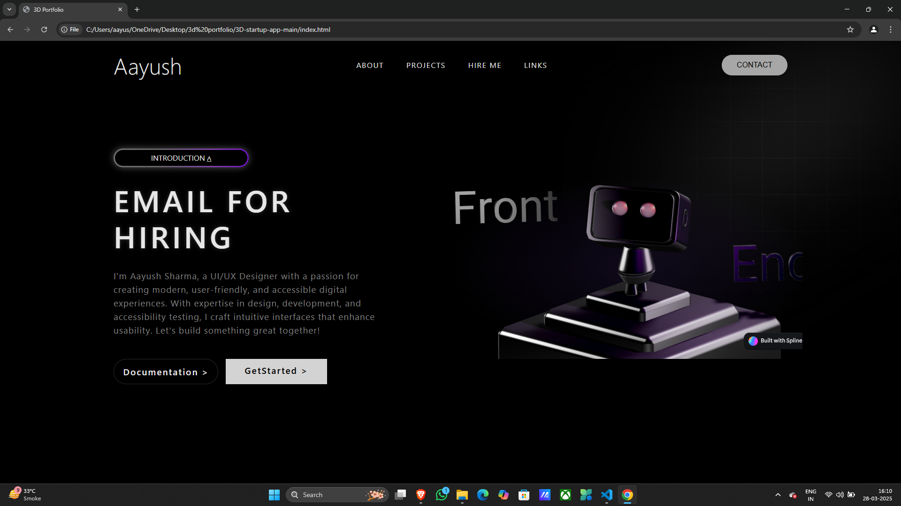

# 3D Portfolio

Welcome to my **3D Portfolio**! This project showcases my work using **HTML, CSS, and Spine** animations to create an interactive and visually engaging portfolio.

## 🚀 Features
- **3D animations** powered by Spine
- **Responsive design** for mobile and desktop
- **Smooth interactions** for an immersive experience

## 🛠️ Technologies Used
- **HTML** for structure
- **CSS** for styling and animations
- **Spine** for 3D animations

## 📂 Setup & Installation
1. Clone the repository:
   ```sh
   git clone https://github.com/your-username/3d-portfolio.git
   ```
3. Open `index.html` in a browser.

## 📸 Preview


## 📬 Contact
Feel free to reach out for collaboration or feedback!

🔗 [LinkedIn](www.linkedin.com/in/sharmaaayush07) | 📧 aayush.sharma0330@gmail.com
